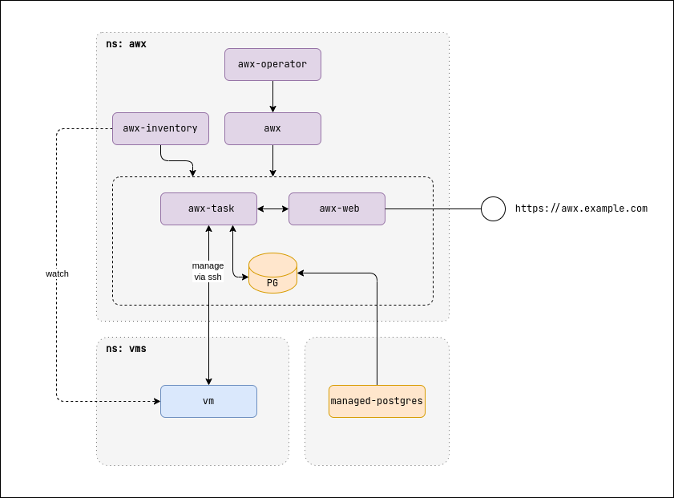

# Ansible Demo

## Ansible via Cloud-init

Run Ansible playbook during VM initialization using cloud-init.

### Quick Start

```bash
# Create VM
kubectl create -f ./vm

# Connect to VM (user/pass: ansible/ansible)
d8 v console -n ansible ansible-demo

# Verify Ansible execution
cat /tmp/ansible_test_file.txt

# Cleanup
kubectl delete -f ./vm
```

### Expected Output

```txt
[   67.344144] cloud-init[1042]: PLAY [Test Ansible Playbook] ***************************************************
[   67.347155] cloud-init[1042]: TASK [Gathering Facts] *********************************************************
[   67.350132] cloud-init[1042]: ok: [localhost]
[   67.350510] cloud-init[1042]: TASK [Update apt cache] ********************************************************
[   67.353202] cloud-init[1042]: changed: [localhost]
[   67.353985] cloud-init[1042]: TASK [Update yum cache] ********************************************************
[   67.356071] cloud-init[1042]: skipping: [localhost]
[   67.358012] cloud-init[1042]: TASK [Update apk cache (Alpine)] ***********************************************
[   67.358814] cloud-init[1042]: skipping: [localhost]
[   67.359229] cloud-init[1042]: TASK [Create test file] ********************************************************
[   67.361016] cloud-init[1042]: changed: [localhost]
[   67.363009] cloud-init[1042]: TASK [Write test content to file] **********************************************
[   67.363783] cloud-init[1042]: changed: [localhost]
[   67.364193] cloud-init[1042]: PLAY RECAP *********************************************************************
[   67.366009] cloud-init[1042]: localhost                  : ok=4    changed=3    unreachable=0    failed=0    skipped=2    rescued=0    ignored=0
[   67.368117] cloud-init[1042]: Starting Ansible Pull at 2025-11-20 06:29:48
[   67.368692] cloud-init[1042]: /usr/bin/ansible-pull --url=https://github.com/fl64/ansible-demo.git test-playbook.yml
```

## AWX



### Installation

```bash
# Install AWX Operator
kubectl apply -k ./awx-operator

# Configure secrets
vi awx/kustomization.yaml

# Install AWX
kubectl apply -k ./awx

# get AWX RW token

# Configure secrets
vi awx-inventory/kustomization.yaml

# Install AWX inventory generator
kubectl apply -k ./awx-inventory
```

### Setup AWX via Web UI

Create Inventory:

```text
Resources → Inventories → Add → Add inventory
Name: vms
Organization: default
```

Add Host:

```text
Resources → Hosts → Add
Name: 10.66.10.4
Inventory: vms
```

Create Credential:

```text
Resources → Credentials → Add
Name: vms
Organization: default
Credential Type: Machine
Username: cloud
SSH Private Key: ...
```

Add Project:

```text
Resources → Projects → Add
Name: https://github.com/fl64/ansible-demo
Organization: default
Source Control Type: Git
Source Control URL: https://github.com/fl64/ansible-demo
```

Create Job Template:

```text
Resources → Templates → Add job template
Name: test
Inventory: vms
Credentials: vms
Project: https://github.com/fl64/ansible-demo
Playbook: test-playbook-all.yaml
```

### Create Inventory via API

1. Generate token: Admin → User details → Tokens → Add (Scope: Write)

2. Get inventory ID:

```bash
curl -sH "Authorization: Bearer YOUR_TOKEN" \
  -X GET https://<awx_server>/api/v2/inventories/ | \
  jq '.results[] | select(.name=="vms") | .id'
```

3. Add hosts:

```bash
# Single host
curl -X POST "https://<awx_server>/api/v2/inventories/2/hosts/" \
  -H "Content-Type: application/json" \
  -H "Authorization: Bearer YOUR_TOKEN" \
  -d '{"name": "10.66.10.5"}'

# Multiple hosts from Kubernetes VMs
for ip in $(kubectl get -A vm -o json | jq '.items[].status.ipAddress' -r); do
  curl -X POST "https://<awx_server>/api/v2/inventories/2/hosts/" \
    -H "Content-Type: application/json" \
    -H "Authorization: Bearer YOUR_TOKEN" \
    -d '{"name": "'${ip}'"}'
done
```
