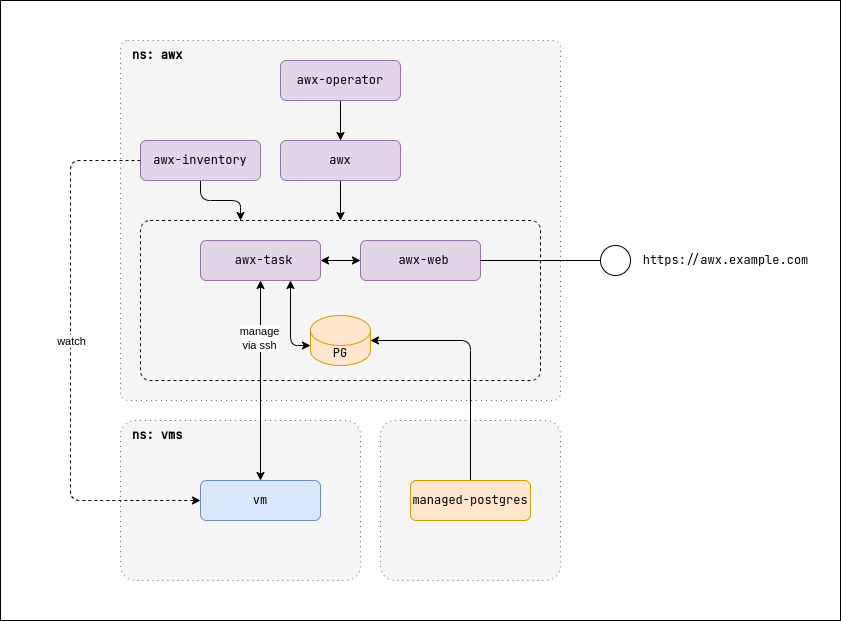

# Ansible Demo — Practical Examples for Deckhouse Virtualization

This repository demonstrates two approaches for running Ansible automation in a Kubernetes environment with Deckhouse Virtualization:

1. **Ansible via Cloud-init** — Run Ansible playbook automatically during VM initialization
2. **AWX Integration** — Enterprise Ansible automation platform with automatic VM inventory discovery

---

## Part 1: Ansible via Cloud-init

Run Ansible playbook automatically when VM starts using cloud-init. The VM pulls the playbook from this GitHub repository and executes it during initialization.

### What Happens During VM Boot

```
VM starts → cloud-init initializes → ansible-pull pulls playbook →
playbook executes → VM is ready with configured software
```

### Prerequisites

- Deckhouse Virtualization module enabled
- Access to container registry for Ubuntu cloud image
- Network access to GitHub (for ansible-pull)

### Quick Start

```bash
# Generate SSH keys and update cloud-init
task ssh-gen
task ssh-update-cloudinit

# Deploy all 3 VMs with cloud-init
task vm:deploy

# Check VM status
kubectl get vm -n ansible-demo

# Connect to VM
task vm:ssh

# Cleanup - delete all VMs
task vm:undeploy
```

### VM Configuration

| Property         | Value                                      |
| ---------------- | ------------------------------------------ |
| OS               | Ubuntu 24.04 (Noble)                       |
| vCPU             | 1 core (50% fraction)                      |
| Memory           | 2 GiB                                      |
| Disk             | 5 GiB (root)                               |
| Username         | `ansible`                                  |
| Password         | `ansible`                                  |
| Ansible Pull URL | `https://github.com/fl64/ansible-demo.git` |
| Playbook         | `demo-project/playbooks/test-playbook.yml` |

### Expected Output

When cloud-init runs, you'll see Ansible output in the console:

```txt
[   67.344144] cloud-init[1042]: PLAY [Test Ansible Playbook] ***************************************************
[   67.347155] cloud-init[1042]: TASK [Gathering Facts] *********************************************************
[   67.350132] cloud-init[1042]: ok: [localhost]
[   67.350510] cloud-init[1042]: TASK [Update apt cache] ********************************************************
[   67.353202] cloud-init[1042]: changed: [localhost]
[   67.353985] cloud-init[1042]: TASK [Update yum cache] ********************************************************
[   67.356071] cloud-init[1042]: skipping: [localhost]
[   67.358012] cloud-init[1042]: TASK [Update apk cache (Alpine)] ***********************************************
[   67.358814] cloud-init[1042]: skipping: [localhost]
[   67.359229] cloud-init[1042]: TASK [Create test file] ********************************************************
[   67.361016] cloud-init[1042]: changed: [localhost]
[   67.363009] cloud-init[1042]: TASK [Write test content to file] **********************************************
[   67.363783] cloud-init[1042]: changed: [localhost]
[   67.364193] cloud-init[1042]: PLAY RECAP *********************************************************************
[   67.366009] cloud-init[1042]: localhost                  : ok=4    changed=3    unreachable=0    failed=0    skipped=2    rescued=0    ignored=0
[   67.368117] cloud-init[1042]: Starting Ansible Pull at 2025-11-20 06:29:48
[   67.368692] cloud-init[1042]: /usr/bin/ansible-pull --url=https://github.com/fl64/ansible-demo.git test-playbook.yml
```

---

## Part 2: AWX Integration

AWX provides enterprise-grade Ansible orchestration with:

- Web UI for job management
- Inventory management with auto-discovery
- Credential storage
- Scheduled jobs
- REST API for automation

### Architecture



### Installation

**Using Helm charts (recommended):**

1. Install AWX Operator (installed in `awx` namespace by default):

```bash
task awx-operator:install
```

2. Edit `values.yaml` in the repository root with your settings:

```yaml
awx:
  host: awx.example.com
  admin:
    password: your-secure-password

db:
  password: your-db-password

dex:
  enabled: true # set to false to disable SSO
```

3. Install AWX (by default, installs in `awx` namespace):

```bash
task install
```

To install in a different namespace, override `AWX_INSTANCE_NS` variable:

```bash
task install AWX_INSTANCE_NS=myonese
```

### Uninstall

```bash
# Remove AWX instance only
task uninstall

# Remove operator
task awx-operator:uninstall
```

### Available Tasks

```bash
task --list
```

| Task                   | Description                    |
| ---------------------- | ------------------------------ |
| awx-operator:install   | Install AWX Operator           |
| awx-operator:uninstall | Uninstall AWX Operator         |
| install                | Install/Upgrade AWX Helm chart |
| uninstall              | Uninstall AWX Helm chart       |
| ssh-gen                | Generate SSH keypair for AWX   |
| ssh-update-cloudinit   | Update SSH key in cloud-init   |
| vm:deploy              | Deploy VMs with cloud-init     |
| vm:undeploy            | Delete VMs                     |
| vm:ssh                 | SSH to VM (VM_NAME=demo-vm-01) |

### Setup AWX via Web UI

> **Note:** If you use `awx-inventory`, the inventory and hosts are created automatically. Skip to [Create Job Template](#create-job-template) if awx-inventory is deployed.

**Create Inventory:**

```
Resources → Inventories → Add → Add inventory
Name: vms
Organization: default
```

**Add Host:**

```
Resources → Hosts → Add
Name: 10.66.10.4
Inventory: vms
```

**Create Credential:**

```
Resources → Credentials → Add
Name: vms
Organization: default
Credential Type: Machine
Username: ansible
SSH Private Key: ...
```

**Add Project:**

```
Resources → Projects → Add
Name: ansible-demo
Organization: default
Source Control Type: Git
Source Control URL: https://github.com/fl64/ansible-demo
```

**Create Job Template:**

```
Resources → Templates → Add job template
Name: test
Inventory: vms
Credentials: vms
Project: ansible-demo
Playbook: test-playbook-all.yaml
```

### Create Inventory via API

1. Generate token: **Admin → User details → Tokens → Add** (Scope: Write)

2. Get inventory ID:

```bash
curl -sH "Authorization: Bearer YOUR_TOKEN" \
  -X GET https://<awx_server>/api/v2/inventories/ | \
  jq '.results[] | select(.name=="vms") | .id'
```

3. Add hosts:

```bash
# Single host
curl -X POST "https://<awx_server>/api/v2/inventories/2/hosts/" \
  -H "Content-Type: application/json" \
  -H "Authorization: Bearer YOUR_TOKEN" \
  -d '{"name": "10.66.10.5"}'

# Multiple hosts from Kubernetes VMs
for ip in $(kubectl get -A vm -o json | jq '.items[].status.ipAddress' -r); do
  curl -X POST "https://<awx_server>/api/v2/inventories/2/hosts/" \
    -H "Content-Type: application/json" \
    -H "Authorization: Bearer YOUR_TOKEN" \
    -d '{"name": "'${ip}'"}'
done
```
